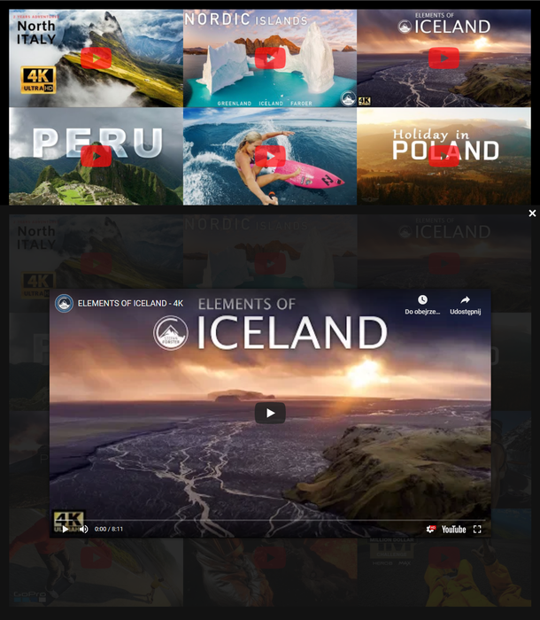

 <h1 align="center">
  Lazy loading youtube
 </h1>

<p align="center">
  Lazy loading youtube on lightbox
</p>

<p align="center">
  
  
  <a href="LICENSE">
    
  </a>
</p>

<p align="center">
  
</p>

## Demo

See the demo - [example](https://tomik23.github.io/lazy-youtube/)

> close the lightbox by pressing the ESC key

## How to configure it?

### First, add CSS and JS

```HTML
<!-- CSS -->
<link rel="stylesheet" href="./path/to/youtubeLazy.min.css">

<!-- JS -->
<script src="./path/to/youtubeLazy.min.js"></script>
```

#### You can download from CDN as well
```html
<!-- CSS -->
<link rel="stylesheet" href="https://cdn.jsdelivr.net/gh/tomik23/lazy-youtube@1.1.3/dist/css/youtubeLazy.min.css"/>

<!-- JS -->
<script src="https://cdn.jsdelivr.net/gh/tomik23/lazy-youtube@1.1.3/dist/js/youtubeLazy.min.js"></script>
```


### Add a div with the appropriate json

- **"id": "TUIbj4mviXU"** - id is the id of the movie you can find it in every youtube link
- **"local": true** - parameter that tells the library that the movie should play in the same div as the thumbnail, not in the lightbox
- **"maxWidth": 50** - the video opens to the given width, it is a percentage, in this example 50%, if there is no number then the video opens to the whole window - 100%. You can also set a global `maxWidth` for all videos that open in the lightbox. Just add the same `maxWidth: 80` parameter to option, see the example below
- **"openIn"** - this parameter allows you to display a button which, when clicked, directly opens the youtube page with the movie. For full functionality you need the corresponding parameter also added to js, see below `createWatchIn: () => {}`
- **"title"** - the title of the video, it is displayed top of container`
- **"picture"** - the parameter is responsible for generating a thumbnail. `TRUE` - generates picture + source + img. `FALSE` - only generate an img thumbnail

```html
<!-- default -->
<div class="ytLazy__item" data-yt='{ "id": "TUIbj4mviXU" }'></div>

<!-- open in same place what thumbnail is -->
<div class="ytLazy__item" data-yt='{ "id": "XHeDps0fX6c", "local": true }'></div>

<!-- set max-width -->
<div class="ytLazy__item" data-yt='{ "id": "XHeDps0fX6c", "maxWidth": 50 }'></div>

<!-- add button "Watch in ..." -->
<div class="ytLazy__item" data-yt='{ "id": "XHeDps0fX6c", "openIn": true }'></div>

<!-- add title -->
<div class="ytLazy__item" data-yt='{ "id": "XHeDps0fX6c", "title": "Movie title ;)" }'></div>

<!-- add picture -->
<div class="ytLazy__item" data-yt='{ "id": "XHeDps0fX6c", "picture": true }'></div>
```
> off course you can mix all of them

### Add a library, configuration options that are not required and call the library

```html
<svg xmlns="http://www.w3.org/2000/svg" style="display: none;">
  <symbol id="youtube-logo" viewBox="0 0 300 67">
    <path ... />
  </symbol>
</svg>

<script src="./path/to/youtubeLazy.min.js"></script>

<script>
  // options are optional
  const options = {
    // you can add color with opacity, default: 'rgba(0,0,0,0.9)'
    // rgba, hsla
    background: 'rgba(0,0,0,0.6)',

    // global setting for the width of the displayed
    // movie as a percentage default 90%
    maxWidth: 80

    // hide overflow to body when open lightbox
    // default false
    overflow: true,

    // genereate picture > source
    picture: true,

    // create your own button to open youtube video page
    createWatchIn: ({ link, template }) => {
      template(`
        <div class="ytLazy__watch-in">
          <a href='${link}' class="ytLazy__watch-in-link" target="_blank">
            <span>Watch in</span>
            <svg><use xlink:href="#youtube-logo"></use></svg>
          </a>
        </div>
      `)
    }
  };

  // ytLazy__item youtube class div with options
  document.addEventListener('DOMContentLoaded', new ytLazy('ytLazy__item', options));

  // or without options
  document.addEventListener('DOMContentLoaded', new ytLazy('ytLazy__item'));
</script>
```

## Browser support

youtubeLazy supports all major browsers including IE 11 and above.

If you need IE support, add this pollyfil to html

```html
<script type="text/javascript">
  if (window.Element && !Element.prototype.closest) {
    var script = document.createElement('script');
    script.src = 'https://polyfill.io/v3/polyfill.min.js?features=Element.prototype.closest';
    document.getElementsByTagName('head')[0].appendChild(script);
  }
</script>
```

### local files

- dist/js/youtubeLazy.ie.min.js
- dist/css/youtubeLazy.ie.min.css

### cdn

- https://cdn.jsdelivr.net/gh/tomik23/lazy-youtube@1.1.3/dist/js/youtubeLazy.ie.min.js
- https://cdn.jsdelivr.net/gh/tomik23/lazy-youtube@1.1.3/dist/css/youtubeLazy.ie.min.css

## License

This project is available under the [MIT](https://opensource.org/licenses/mit-license.php) license.